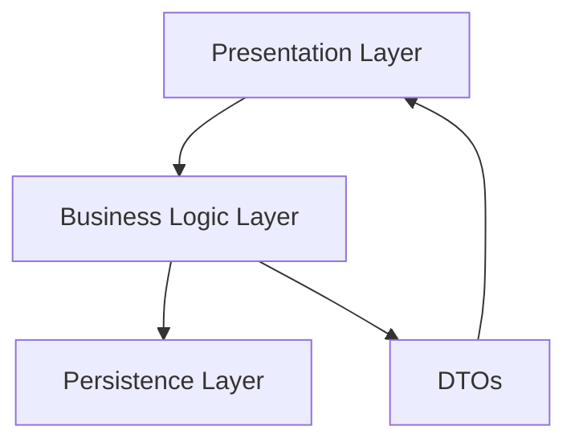
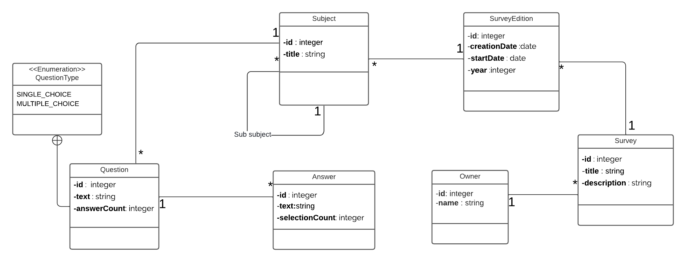

<div align="center">

# ITLens 🔍

> An Advanced Survey Management System for Efficient Data Processing

[](https://www.oracle.com/java/)
[](https://spring.io/projects/spring-boot)
[](https://www.postgresql.org/)
[](LICENSE)
[](swagger-ui.html)

[Quick Start](#-getting-started) • [Features](#-features) • [API Documentation](#-api-documentation) • [Architecture](#-architecture)

</div>

## 🌟 Overview

**ITLens** is a cutting-edge survey management system built with Spring Boot, designed to streamline the process of creating, managing, and analyzing surveys. Our platform offers a powerful combination of flexibility and performance, making it ideal for organizations seeking robust data collection and analysis capabilities.

## ✨ Features

### Core Capabilities
- 📊 **Advanced Survey Management**
    - Multi-version survey support
    - Real-time data updates
    - Comprehensive validation system
    - Dynamic form generation

- 🌳 **Intelligent Subject Organization**
    - Hierarchical subject structure
    - Custom categorization options
    - Advanced recursive querying
    - Flexible taxonomy management

- 🛡️ **Enterprise-Grade Security**
    - RESTful API security
    - Input sanitization
    - Comprehensive error handling
    - Data validation

## 🏗️ Architecture

ITLens follows a clean, layered architecture that ensures maintainability and scalability:



### Layer Description
- **Presentation Layer**: RESTful API endpoints and controllers
- **Business Layer**: Core business logic and service implementations
- **Persistence Layer**: Data access and repository management
- **DTO Layer**: Data transfer objects for clean API communication

## 💻 Tech Stack

### Core Technologies
- **Backend Framework**
    - Java 17+
    - Spring Boot 3.2.0
    - Spring Data JPA
    - Spring Web MVC

- **Database**
    - PostgreSQL 16.0

- **Development Tools**
    - MapStruct 1.5.5
    - Lombok
    - Maven 3.9.0+
    - Swagger/OpenAPI 3.0

## 📚 API Documentation

### Key Endpoints

#### Subject Management
```http
GET    /api/v1/subjects          # List all subjects
POST   /api/v1/subjects          # Create subject
GET    /api/v1/subjects/{id}     # Get subject details
PUT    /api/v1/subjects/{id}     # Update subject
DELETE /api/v1/subjects/{id}     # Remove subject
```

#### Survey Operations
```http
GET    /api/v1/surveys           # List all surveys
POST   /api/v1/surveys           # Create survey
GET    /api/v1/surveys/{id}      # Get survey details
PUT    /api/v1/surveys/{id}      # Update survey
DELETE /api/v1/surveys/{id}      # Delete survey
```

> 📖 **Full API Documentation**: Access our interactive API documentation at `http://localhost:8080/swagger-ui.html`

## 🚀 Getting Started

### Prerequisites
- Java 17 or higher
- Maven 3.9.0+
- PostgreSQL 16
- Your favorite IDE (IntelliJ IDEA recommended)

### Installation

1. **Clone the Repository**
```bash
git clone https://github.com/ouchin55edcx/ITlens.git
cd ITlens
```

2. **Configure Database**
```properties
# src/main/resources/application.properties
spring.datasource.url=jdbc:postgresql://localhost:5432/itlens
spring.datasource.username=postgres
spring.datasource.password=admin
spring.jpa.hibernate.ddl-auto=update
```

3. **Build and Run**
```bash
# Build the project
mvn clean install

# Start the application
mvn spring-boot:run
```

4. **Verify Installation**
```bash
curl http://localhost:8080/api/v1/health
```

## 📦 Class Diagram


## 🤝 Contributing

Contributions are what make the open source community an amazing place to learn, inspire, and create. Any contributions you make are **greatly appreciated**.

1. Fork the Project
2. Create your Feature Branch (`git checkout -b feature/AmazingFeature`)
3. Commit your Changes (`git commit -m 'Add some AmazingFeature'`)
4. Push to the Branch (`git push origin feature/AmazingFeature`)
5. Open a Pull Request

## 📝 License

This project is licensed under the MIT License - see the [LICENSE](LICENSE) file for details.

---

<div align="center">

Created with ❤️ by [ouchin55edcx](https://github.com/ouchin55edcx)

</div>