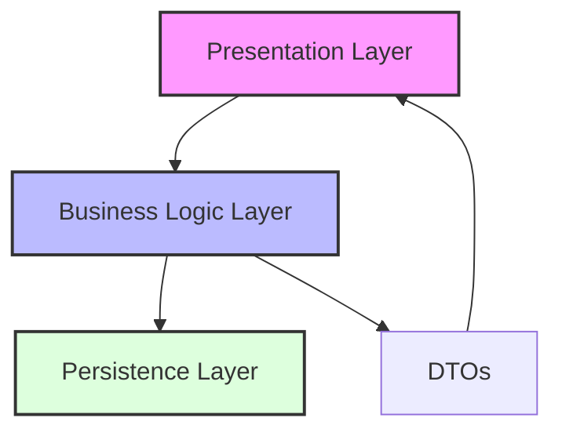
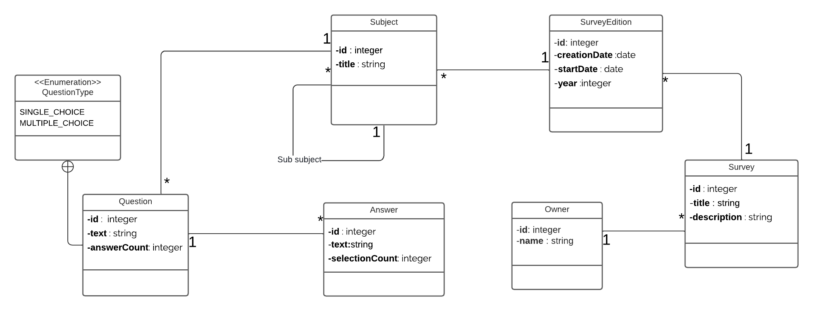

<div align="center">

# 🔍 ITLens Project

[](https://www.oracle.com/java/)
[](https://spring.io/projects/spring-boot)
[](https://www.postgresql.org/)
[](LICENSE)
[](swagger-ui.html)

*An Advanced Survey Management System for Efficient Data Processing*

[Quick Start](#-getting-started) • [API Docs](#-api--documentation) • [Features](#-key-features) • [Architecture](#-architecture)

</div>

---

## 📑 Table of Contents
- [Overview](#-overview)
- [Architecture](#-architecture)
- [Class Diagram](#-class-diagram)
- [Tech Stack](#-tech-stack)
- [API Documentation](#-api--documentation)
- [Key Features](#-key-features)
- [Getting Started](#-getting-started)

## 🎯 Overview
**ITLens** is a robust Spring Boot application designed to revolutionize survey management. It provides a seamless interface for handling survey data, subjects, and questionnaires with advanced features for data processing and analysis. The system's flexible architecture makes it adaptable across various survey domains while maintaining high performance and scalability.

## 🏗️ Architecture
The application implements a clean, layered architecture ensuring separation of concerns:



- **🖥️ Presentation Layer**: REST Controllers & API Endpoints
- **⚙️ Business Layer**: Services & Business Logic
- **💾 Persistence Layer**: Repositories & Data Access
- **📦 DTOs**: Data Transfer & Validation

## 📊 Class Diagram


## 🛠️ Tech Stack

### Core Technologies
- **☕ Java 17+**
- **🌱 Spring Boot 3.2.0**
    - Spring Data JPA
    - Spring Web MVC
    - Spring Validation
- **🐘 PostgreSQL 16**
- **🔄 MapStruct 1.5.5**
- **🧪 JUnit 5 & Mockito**

### Development Tools
- **📦 Maven 3.9.0+**
- **📚 Swagger/OpenAPI 3.0**
- **🔍 Lombok**

## 🔌 API & Documentation

### REST Endpoints

#### 📋 Subject Management
```http
GET    /api/v1/subjects          # Retrieve all subjects
GET    /api/v1/subjects/{id}     # Get subject by ID
POST   /api/v1/subjects          # Create new subject
PUT    /api/v1/subjects/{id}     # Update subject
DELETE /api/v1/subjects/{id}     # Remove subject
```

#### 📊 Survey Operations
```http
GET    /api/v1/surveys           # List all surveys
GET    /api/v1/surveys/{id}      # Get survey details
POST   /api/v1/surveys           # Create survey
PUT    /api/v1/surveys/{id}      # Update survey
DELETE /api/v1/surveys/{id}      # Delete survey
```

> 📘 **Interactive API Documentation**: Available at `http://localhost:8080/swagger-ui.html`

## ⭐ Key Features

- 📊 **Advanced Survey Management**
    - Multi-version support
    - Real-time updates
    - Data validation

- 🌳 **Hierarchical Subject System**
    - Dynamic relationships
    - Custom categorization
    - Recursive queries

- 🔒 **Security & Integration**
    - RESTful architecture
    - Input validation
    - Error handling

## 🚀 Getting Started

### System Requirements

- ☕ Java 17 or newer
- 📦 Maven 3.9.0+
- 🐘 PostgreSQL 16
- 💻 IDE (IntelliJ IDEA recommended)

### Setup Instructions

1. **Clone Repository**
   ```bash
   git clone https://github.com/ouchin55edcx/ITlens.git
   cd ITlens
   ```

2. **Database Configuration**
   ```properties
   # application.properties
   spring.datasource.url=jdbc:postgresql://localhost:5432/itlens
   spring.datasource.username=postgres
   spring.datasource.password=admin
   spring.jpa.hibernate.ddl-auto=update
   ```

3. **Build & Launch**
   ```bash
   mvn clean install
   mvn spring-boot:run
   ```

4. **Verify Installation**
   ```bash
   curl http://localhost:8080/api/v1/health
   ```

---

<div align="center">

Developed with ❤️ by [ouchin55edcx](https://github.com/ouchin55edcx)

</div>